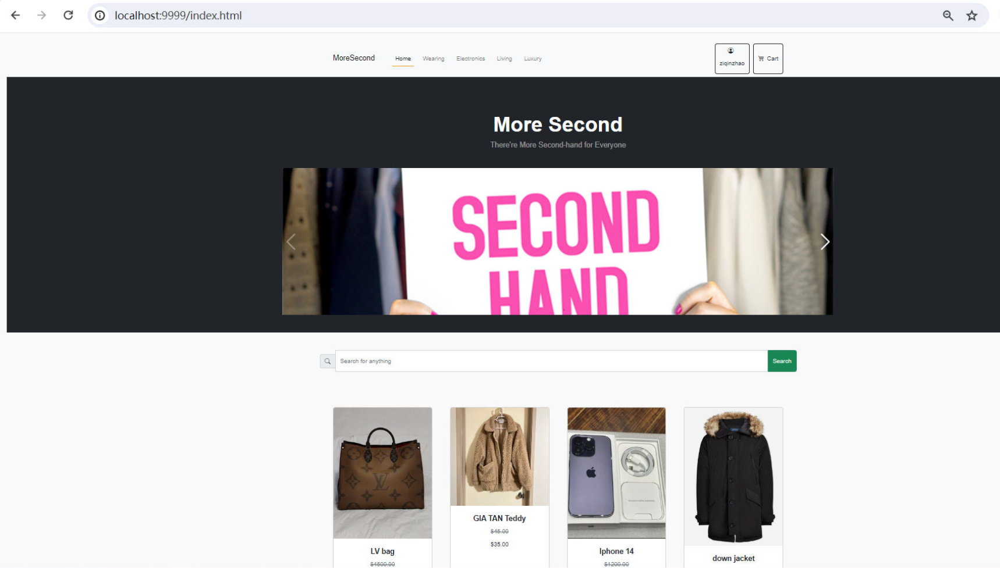
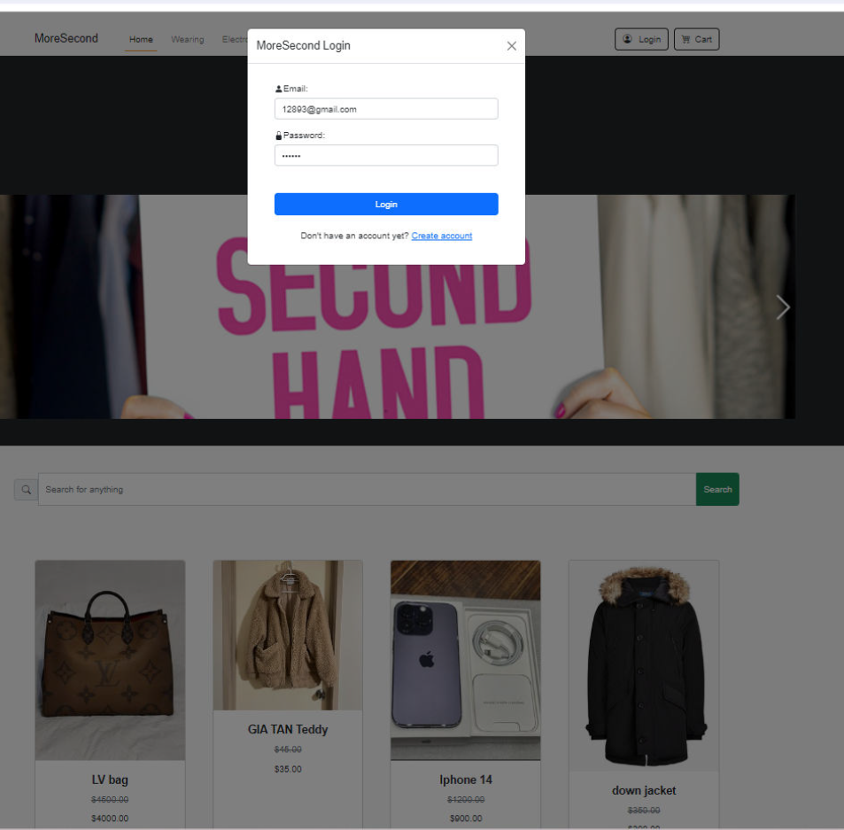
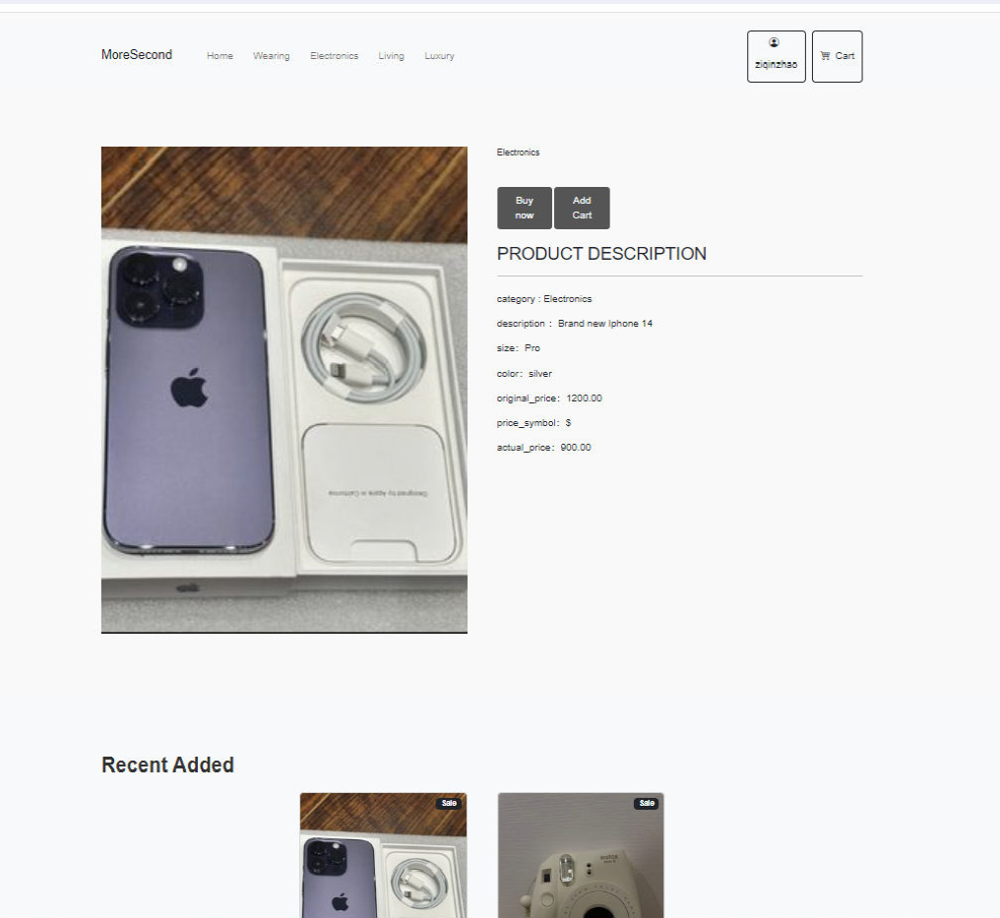
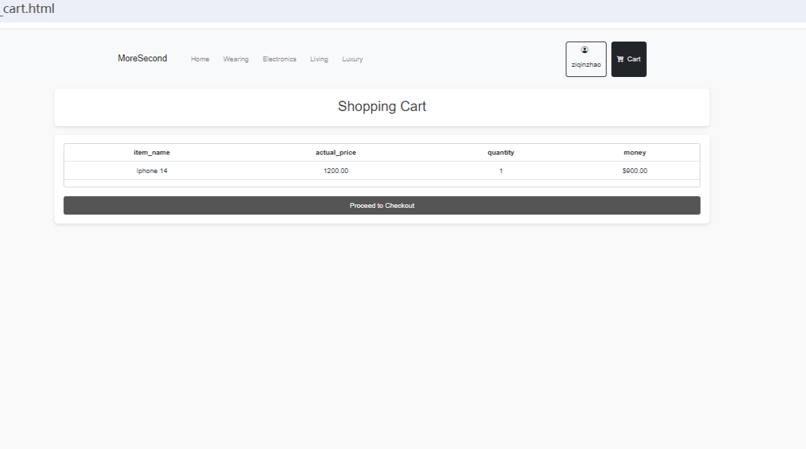
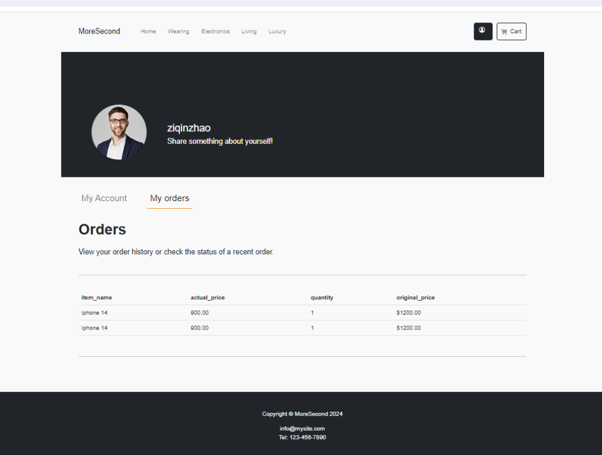

# MoreSecond – Frontend UI Case Study

## Project Overview

MoreSecond is a second-hand e-commerce web interface designed to provide a clean, structured, and user-friendly trading experience between buyers and sellers.

This project was developed as part of a team-based university project.  
My primary focus was on frontend development, UI/UX design, and shopping workflow implementation.

This repository presents the **frontend case study version** of the project.

---

## My Role

**Frontend Developer & Website Designer**

I was responsible for:

- Designing wireframes and user flow diagrams
- Creating process flow and shopping journey logic
- Designing and implementing:
  - Login & Registration interfaces
  - Shopping Cart page and UI logic
  - Checkout page flow
  - Order Confirmation page
- Structuring frontend components and page layouts
- Improving usability and interaction consistency
- Finalising cart and checkout workflow in Sprint 2

I focused on frontend experience and UI behaviour.  
Backend API, database setup, and server infrastructure were handled by another team member.

---

## Key Features

- Homepage with navigation and product categories
- Category-based browsing (Electronics, Living, Luxury, Wears)
- Product detail page layout
- Login and registration modal interface
- Add-to-cart interaction
- Shopping cart summary page
- Checkout page with structured order review
- Order confirmation page
- Account dashboard layout
- Responsive layout using Bootstrap grid system

---

## UI / UX Design Approach

### 1. Shopping Flow First
The shopping cart → checkout → confirmation journey was designed to be:
- Linear
- Clear
- Low friction
- Easy to review before payment

### 2. Visual Hierarchy
- Product cards emphasize image first
- Price and title clearly separated
- Clean spacing to reduce visual clutter

### 3. Modal Authentication
Login and registration were implemented using modal-based flow to:
- Reduce navigation disruption
- Maintain page context
- Improve user continuity

### 4. Consistency
- Unified spacing system
- Consistent button styling
- Clear CTA positioning
- Structured page sections

---

## Tech Stack

Frontend:
- HTML5
- CSS3
- JavaScript
- Bootstrap
- jQuery
- Axios (API communication)

Backend (Team Collaboration):
- Node.js
- Express
- MongoDB

---

## Project Structure

```
moresecond-frontend-ui-case-study
│
├── index.html
├── pages/
├── assets/
│   ├── images/
│   ├── icons/
├── css/
│   └── styles.css
├── js/
├── screenshots/
└── README.md
```

---

## Screenshots

### Homepage


### Login Modal


### Product Page


### Shopping Cart


### Account Dashboard


---

## What This Case Study Demonstrates

- Structured UI implementation
- Shopping workflow design thinking
- Wireframe-to-implementation translation
- Frontend and backend API integration
- Responsive layout structuring
- Team-based Agile collaboration

---

## Author

Fuk Sang Wong (Sam)  
Master of Information Technology  
Frontend & UI-focused Developer